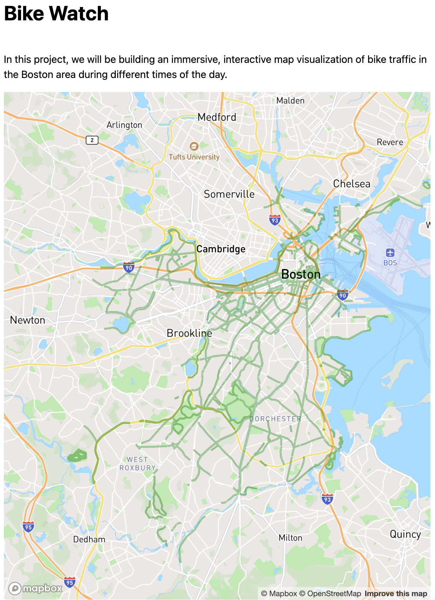
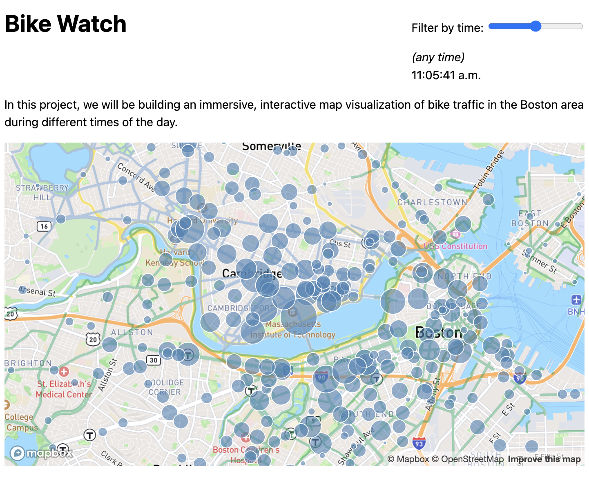

# Notes
Follows from [svelte-vis-1](hhttps://github.com/ccalobeto/svelte-vis-1).

# Lab 8: Geospatial visualizations
## 8.0 Setup
Create a project following these [steps](https://github.com/ccalobeto/svelte-portfolio/blob/main/README.md#lab-4-svelte-templating--control-flow)

Publish your project

Add some content to your `routes/+page.svelte`

Add some basic styling

Add a custom favicon and a title

## 8.1: My first map
### 8.1.0: Setup Mapbox Tool
Create a mapbox account.

Install mapbox utility.

```
npm install mapbox-gl
```

Add a `<div id="map" />` element to hold the map.

Import mapboxgl and connect it to your account. Make a .env file to protect your token. It must start with VITE_ prefix to be imported by `import.meta.env`.

### 8.1.4: Create the map
Create a map object using `mapboxgl.Map` with settings like: container HTML-element, basemap, center-coordinates and zoom.

Use `onMount` to display the map in the browser.

See dev tools what are the elements added by mapbox.


### 8.1.5: Customizing the map (optional)
Using mapbox studio to create your own *map style*.

Select a styles, publish in your account, get the style URL (something like 'mapbox://styles/casillasenrique/clukyyerk007v01pb6r107k1o') and place it in your map object in your project.


## 8.2: Adding bike lanes
Adding **layer** to our map

### 8.2.1: Import the data
Adding bike lanes of Boston **layer** to our map.

Use `addSource` method to connect the map to an external data. But first you have to wait for the `"load"` event to fire on `map`. So,

Convert `onMount` function to an `async` function

Add the load event

Add the `map.addSource` method

(optional) If you want use pre-charged data: 

Create an async function outside `onMount`
```js
async function loadGeoJSON() {
    const response = await fetch('path/to/your/geojson.geojson');
    const data = await response.json();
    return data;
  }
```
Then load geojson data 
```js
onMount(async() => { 
  ...
  const geojson = await loadGeoJSON();
  map.addSource('my-source', {
      type: 'geojson',
      data: geojson
    });
  ...
})
```

## 8.2.2: Drawing bike lanes on the map
(Styling is 8.2.3)

Add a layer to our map with `map.addLayer`, style it in *paint* property.



## 8.2.4: Adding Cambridge bike lanes
Adding bike lanes of Cambridge **layer** to our map.

## 8.3: Adding bike stations

We will add this data `https://vis-society.github.io/labs/8/data/bluebikes-stations.csv` to our map. 

### 8.3.1 Fetching and parsing the CSV
Load stations data using d3.csv

### 8.3.2: Overlaying SVG on the map

Append an `svg` element to our `div` container. In dev tools you will see a smaller `svg` element

Style `svg` element.

Remove [background]() and [opacity](), they were just for debugging.


### 8.3.3: Adding station markers
Here we will append a bunch of circles to the SVG element, each representing a station.

Move variables (map and stations) out of `onMounth()` callback so that they are visible to the HTML template too.

Create a `getCoordinates()` helper function to obtain the center of circle, which inside use a built-in function `map.project()` that returns the map coordinates in pixels.

Then use {#each} block to loop over the stations and append `<circle>` elements


### 8.3.4: Adjusting station markers when map is zoomed/panned

The map breaks down if we try to span, zoom or rotate. Here we will fix it!

Video
<video src="./static/images/8-fix-station-zooming-splatters.mp4" autoplay muted loop></video>

https://github.com/user-attachments/assets/4e5aa0ca-296d-4fb5-94b8-fa55d65daa38


Svelte's reactivity is not working as expected because zooming and panning changed too. These side effects (dependencies that are not visible in the code), we need to take care of updating the state ourselves. 

So <u>move</u> fires an event when a map is moved(panned, zoomed, rotated etc). Use in combination with `mapViewChanged` variable to count it. 

Finally use {#key} block to force a re-render when a varible changes.

> The last suggestion could be resolved giving `mapViewChanged` as a dummy parameter to `getCoordinates()`, but it will be look like a *hack* when it is intentional. It also means it could break in the future if Svelte becomes smarter about detecting dependencies.

Video
<video src="./static/images/8-fix-panning.mp4" autoplay muted loop></video>

https://github.com/user-attachments/assets/54120f51-128a-4ef5-ac13-60b2b1858eef


## 8.4: Visualizing bike traffic
Set the size of the circles according the amount of traffic at each station

### 8.4.1: Importing and parsing the traffic data
Fetch  'https://vis-society.github.io/labs/8/data/bluebikes-traffic-2024-03.csv' and call it `trips`.

### 8.4.2: Calculating traffic at each station

Use `d3.rollup()` to calculate arrivals, departures and total traffic to each station.

Then add this properties to each station.

### 8.4.3: Size markers according to traffic

Adjust the radius of the circles to the total traffic.

Style the circle for a better view.


### 8.4.4: Adding a tooltip with exact traffic numbers (optional)
Build a simple tooltip with title and add `pointer-events: auto` to our CSS rule for circle to recover displaying in the circles.

## 8.5: Interactive data filtering
Let’s add some interactive filtering with a slider for arrival/departure time.

### 8.5.1: Adding the HTML and CSS for the slider
Add this elements 
- A slider (`<input type=range>`) wiht min of -1 to 1440 (minutes per day).
- A `<time>` element.
- An `<em>(any time)</em>` element that will be shown when the slider is at -1.
- A `<label>` around the slider and `<time>` element with some explanatory text (e.g. “Filter by time:”).

Apply some styling.



### 8.5.2: Reactivity
Create a `timeFilter` variable and use [bind:value](https://svelte.dev/docs/element-directives#bind-property) on the slider to **reactively** update its value as the slider is moved.

Then define a reactive variable `timeFilterLabel` to display the updated value in `<time>` element.


### 8.5.3: Filtering the data
We need to do:

- Write code to obtain data that corresponds to the filter. So we are going to build: `filteredTrips`, `filteredArrivals`, `filteredDepartures` and `filteredStations`.

- Update the HTML templates with new data.

The slider shows the variable *number of minutes since midnight* and our trip data (`started_at` and `ended_at`) has string dates so we have to convert to dates first to compute the variable.

**trip data** is a big data and we need to do the conversion once, so use `onMount()` just after the fetch with `then()`, a method of the `Promise`. 

```js
trips = await d3.csv(TRIP_DATA_URL).then((trips) => {
			for (let trip of trips) {
				trip.started_at = new Date(trip.started_at);
				trip.ended_at = new Date(trip.ended_at);
			}
			return trips;
		});
```

This function returns the number of minutes since midnight:

```js
function minutesSinceMidnight (date) {
	return date.getHours() * 60 + date.getMinutes();
}
```

Then, we can use this function to **filter the data to trips that started or ended within 1 hour before or after the selected time**:

```js
$: filteredTrips = timeFilter === -1? trips : trips.filter(trip => {
	let startedMinutes = minutesSinceMidnight(trip.started_at);
	let endedMinutes = minutesSinceMidnight(trip.ended_at);
	return Math.abs(startedMinutes - timeFilter) <= 60
	       || Math.abs(endedMinutes - timeFilter) <= 60;
});
```

Like `filteredTrips`, create new data structures for `filteredArrivals`, `filteredDepartures`, and `filteredStations`. These are reactive statements because you are using a slicer and your visual data change.

For `filteredStations` be careful and clone the `station` object before any operation to avoid any modification to your *original* station object since [in JS, objects are passed around by reference!](https://dev.to/bbarbour/passed-by-reference-vs-value-in-javascript-2fna).

```js
$: filteredStations = stations.map((station) => {
		station = { ...station }; // clone first
		let id = station.Number;
		station.arrivals = filteredArrivals.get(id) ?? 0;
		station.departures = filteredDepartures.get(id) ?? 0;
		station.totalTraffic = station.arrivals + station.departures;
		return station;
	});
```

Finally, make a conditional scale in `rscale` to have bigger circles, since there's fewer data.
```js
.range(timeFilter === -1 ? [0, 25] : [3, 50]);
```

Video
<video src="./static/images/8-filtering.mp4" autoplay muted loop></video>

https://github.com/user-attachments/assets/7d694862-95fd-417b-8135-24d93a235309


### 8.5.4: Performance optimizations (optional if you don’t have this problem)
Notice that moving the slider now does not feel as smooth as it did before we implemented the filtering. This is because every time we move the slider, we filter the trips, which is a relatively expensive operation given that we have over a quarter of a million of them! Worse, every time we do this filtering, nothing else can happen until the filtering ends, including things like the browser updating the slider position! This is commonly referred to as “blocking the main thread”.

There are many ways to improve this. [Throttling and debouncing](https://css-tricks.com/debouncing-throttling-explained-examples/) are two common techniques to limit the rate at which a certain (expensive) piece of code is called in response to user action.

In this case, we can make the filtering a lot less expensive by presorting the trips into 1440 “buckets”, one for each minute of the day. Then, instead of going over 260 K trips every time the slider moves, we only need to go over the trips in the 1140 buckets corresponding to the selected time.

So define arrays of 1440 elements
```js
let departuresByMinute = Array.from({length: 1440}, () => []);
let arrivalsByMinute = Array.from({length: 1440}, () => []);
```

In `onMount()` append the trips per minute in the arrays `departuresByMinute` and `arrivalsByMinute`.

Then filter the array by selecting the `timeFilter` variable associated to the HTML element. But it only works between 1AM and 11PM.
```js
departuresByMinute.slice(timeFilter - 60, timeFilter + 60).flat().
```

In these cases, we basically want two separate array.slice() operations: one for the times before midnight and one for those after, that we then combine.
That's we do on `filterByMinute(tripsByMinute, minute)` function.

Video
<video src="./static/images/8-filter-optimized.mp4" autoplay muted loop></video>


https://github.com/user-attachments/assets/c83fa352-8ad9-4a04-8bfb-a70cca1b5a42


## 8.6: Visualizing traffic flow 
In this step, we will use circle color to visualize traffic flow at different times of the day.

### 8.6.1: Make circle color depend on traffic flow
Colors associated with discrete output. 

Use `stationFlow` quantize scale function. Notice that this is not a reactive statement, since it does not depend on any variables.

Calculate the `departure-ratio` inside *style* property of the circle.

And by CSS, assign the color. 

Video
<video src="./static/images/8-traffic-flow.mp4" autoplay muted loop></video>


https://github.com/user-attachments/assets/3a7ff954-ba96-4761-93e0-f0b0e4d19c89


### 8.6.2: Adding a legend
Add a color to the three color legend


> [!WARNING]
> Strange things happen with multiple svgs in mobile browser.


