# create-svelte

Everything you need to build a Svelte project, powered by [`create-svelte`](https://github.com/sveltejs/kit/tree/main/packages/create-svelte).

## Creating a project

If you're seeing this, you've probably already done this step. Congrats!

```bash
# create a new project in the current directory
npm create svelte@latest

# create a new project in my-app
npm create svelte@latest my-app
```

## Developing

Once you've created a project and installed dependencies with `npm install` (or `pnpm install` or `yarn`), start a development server:

```bash
npm run dev

# or start the server and open the app in a new browser tab
npm run dev -- --open
```

## Building

To create a production version of your app:

```bash
npm run build
```

You can preview the production build with `npm run preview`.

> To deploy your app, you may need to install an [adapter](https://kit.svelte.dev/docs/adapters) for your target environment.

# Notes
These are useful concepts to follow a successful carreer in data visualization. Taken from the course [vis-society](https://vis-society.github.io/) from MIT.
All the lab progress are in the commits.

## Lab 0. Setup
Installation of tools:
- Install *VS Code* and basic extensions
- Learn *git* commands and *Github*
- Learn how to use *Node.js* and *npm*
- Install extension *Live Server* in VS Code
- Install extension *for Svelte* in VS Code

## Lab 1: Introduction to the Web platform
This is a starting point of web development
### 1.1 Some Web fundamentals
- Other useful courses are [6.813/6.831: User Interface Design & Implementation](https://web.mit.edu/6.813/www/sp18/) and [6.S063 Design for the web: Languages and User Interfaces](https://designftw.mit.edu/)
- Relative URL concepts:
	 If a relative URL starts with a `'/'`, it is relative to the root of the host. `..` means "go up one level" and `.` refers to the current directory.
- Going through web development, remember that it is possible to have `<script>` elements without type="module", but we recommend you always use type="module" as it enables a few modern JS features and prevents certain errors.
- Error handling in web development
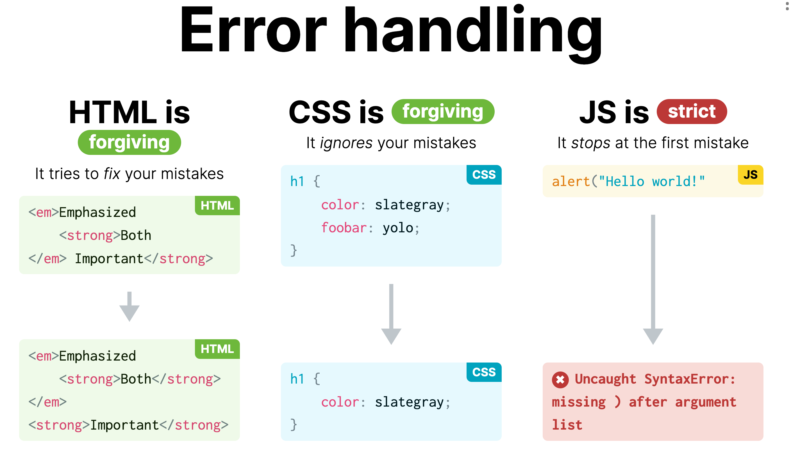
- HTML cheatsheet
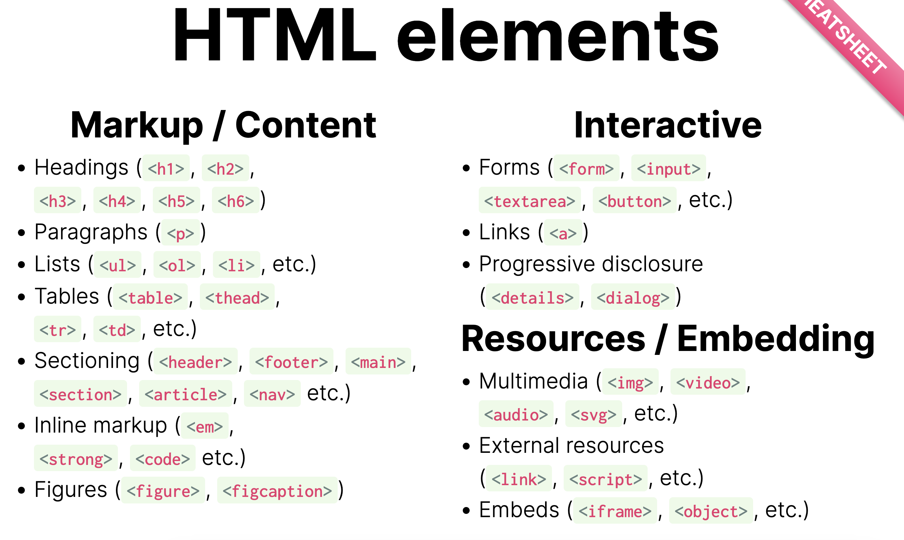

### 1.2 Creating our own website from scratch and publishing it on the Web
Create a simple website and publish in GitHub. It should have: introduction text, a photo, some style, a navigation menu and forms.

## Lab 2: Styling with CSS
### Slides
- Every HTML element produces a box
- CSS concepts
`display:flex` or `display:grid`
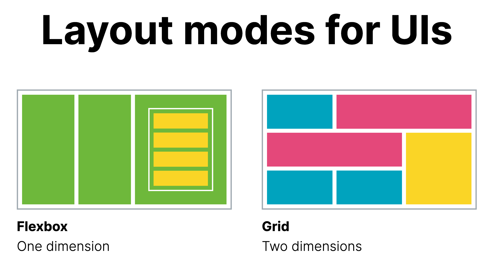
- HTML pages are trees
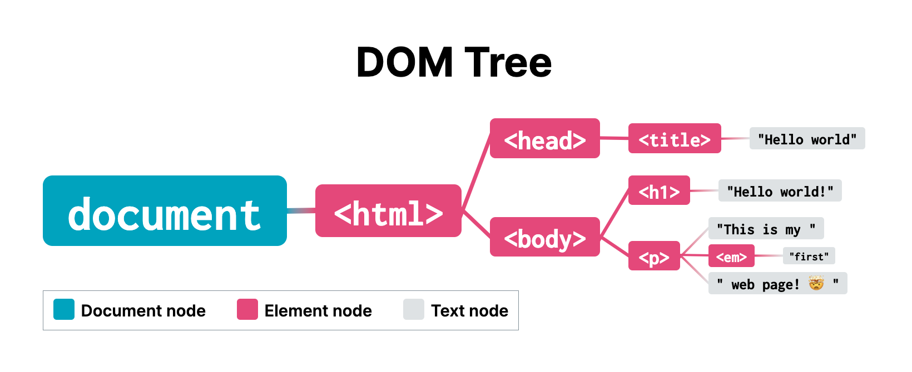
- Styling
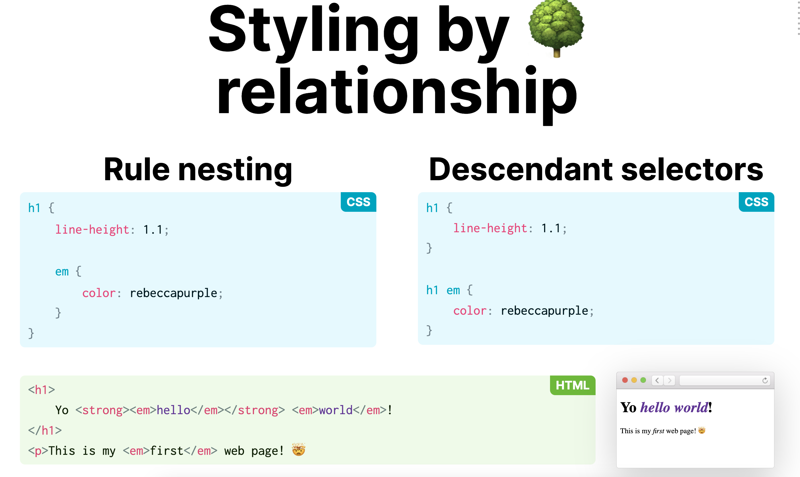
- Targeting
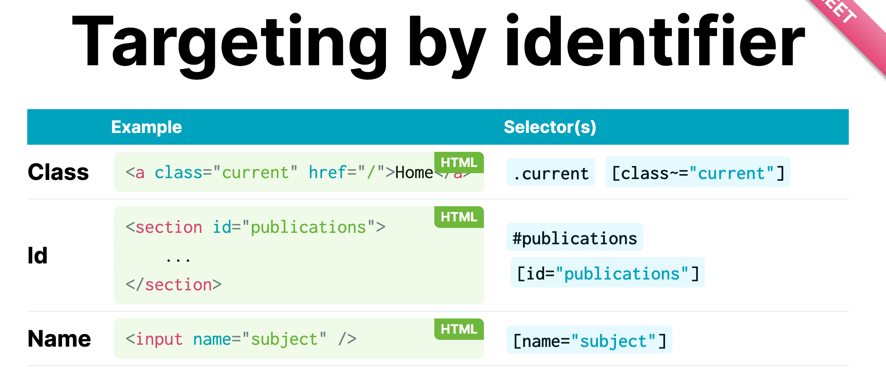
- Pseudo classes
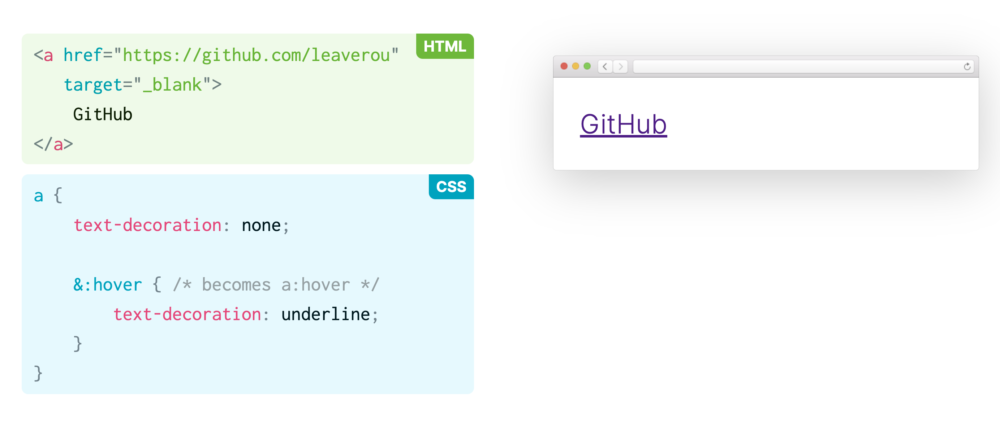
- Reactivity
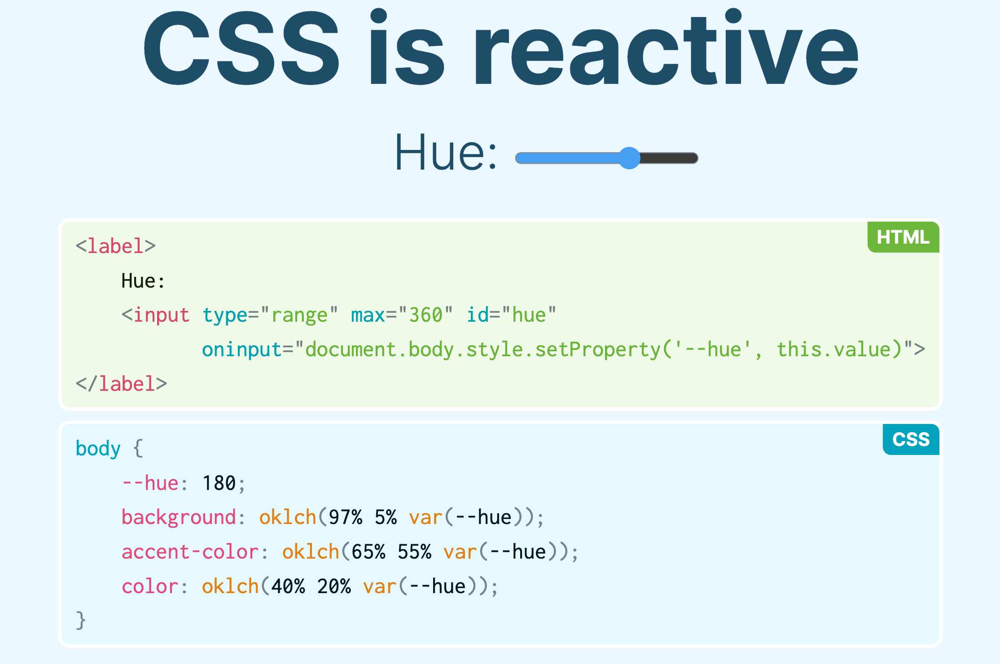
- If there is a duplicate declaration in CSS, the last one wins!
- Even if you don't apply any CSS to your page, the browser will do.
- Being specificitty
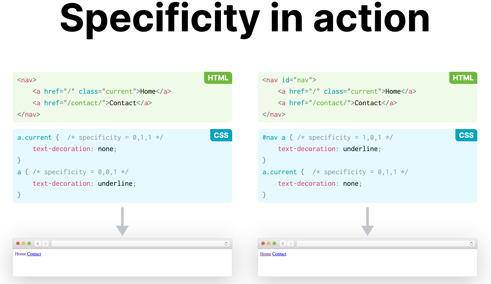

### Lab
Style your project page
- Use css for styles
- Use responsive Grid

svelte-portfolio/static/style.css
```
.projects {
  display: grid;
  grid-template-columns: repeat(auto-fill, minmax(15em, 1fr));
}
```
- Use an Horizontal alignment with subgrid

svelte-portfolio/static/style.css
```
 article {
    grid-template-rows: subgrid;
    grid-row: span 1;
  }
```

## Lab 3: Introduction to JS
### Slides
- JS is a language that runs in the browser (but can also run on the server, in native applications, etc.)
- The console for debugging 

A useful command to interact with dev tools is `$$` which give you a list of elements matching a selector
```
$$("*").length
```
<video src="./static/images/3-js-console.mp4" autoplay muted loop></video>
- Read about JS data types and object properties
- In addition to object properties, their values can be functions

- Reference elements
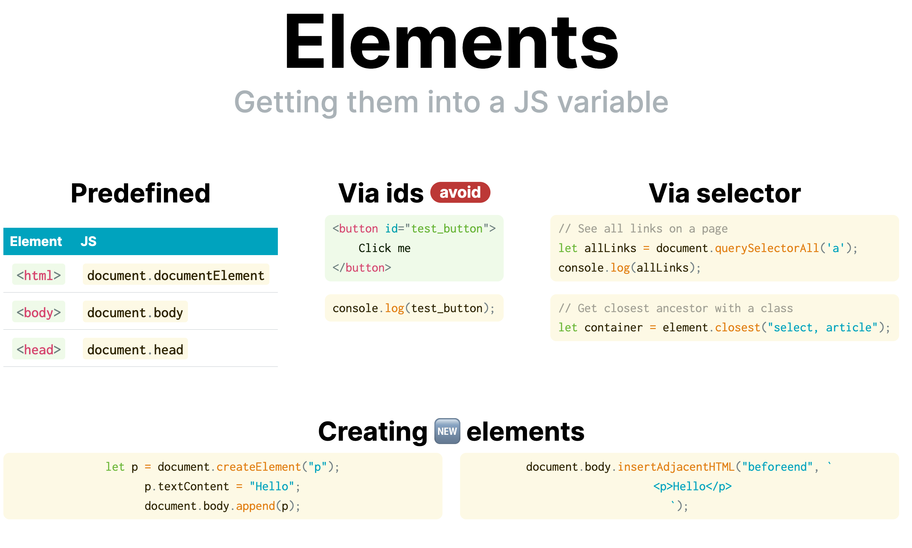
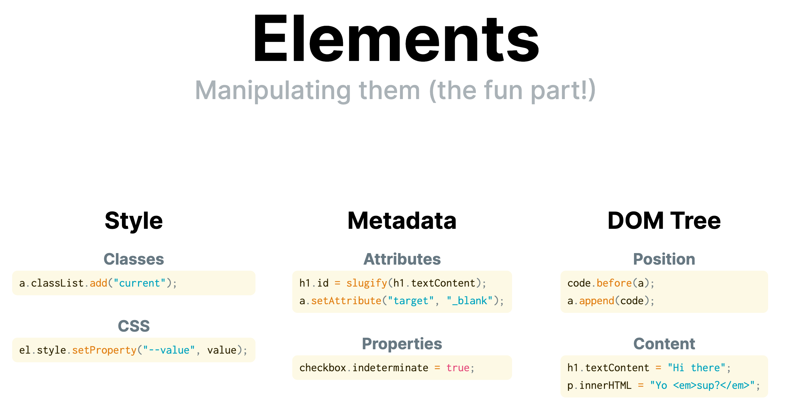
- Events
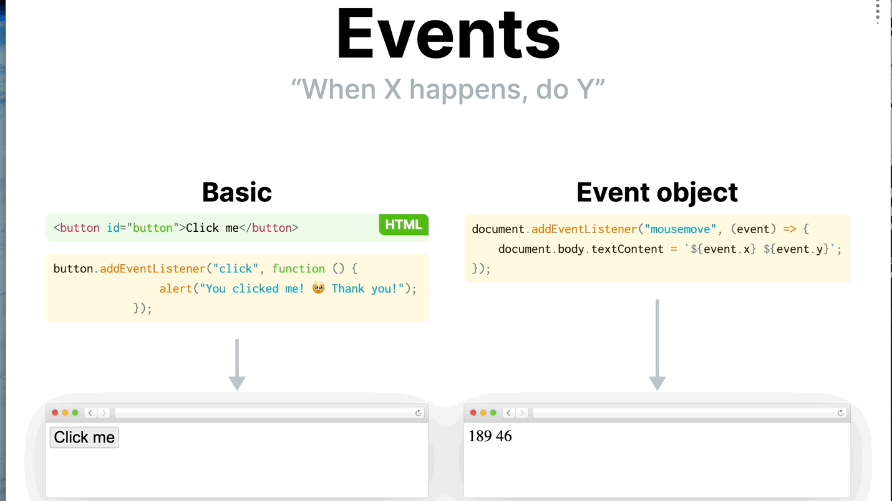

### Lab
- Add a JS file (global.js) to all pages
- Add an automatic current page link
- Add an automatic navigation menu  
From an array pass data to set the nav links
- Highlighting the current page and opening external links in a new tab
- Adding HTML for the dark mode switch, placed it at the top right corner, and use event Listeners to obtain the value of UI `select` control when it changes.
- Saving the user’s preference to keep the schemeColor in other pages
`localStorage.colorScheme = event.target.value`

## Lab 4: Svelte (Templating & Control Flow)
### Slides
- *npm* is a package manager such as *pip* or *brew*
- Build process
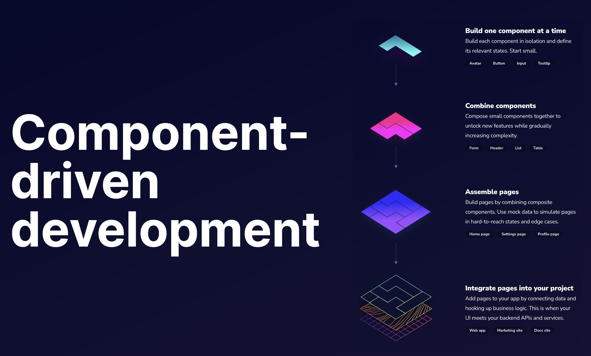
- Traditional architecture

- Component base Architecture (cba)
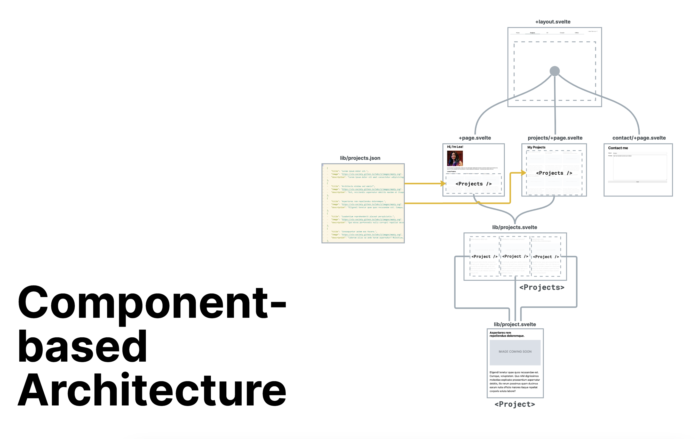
- Components
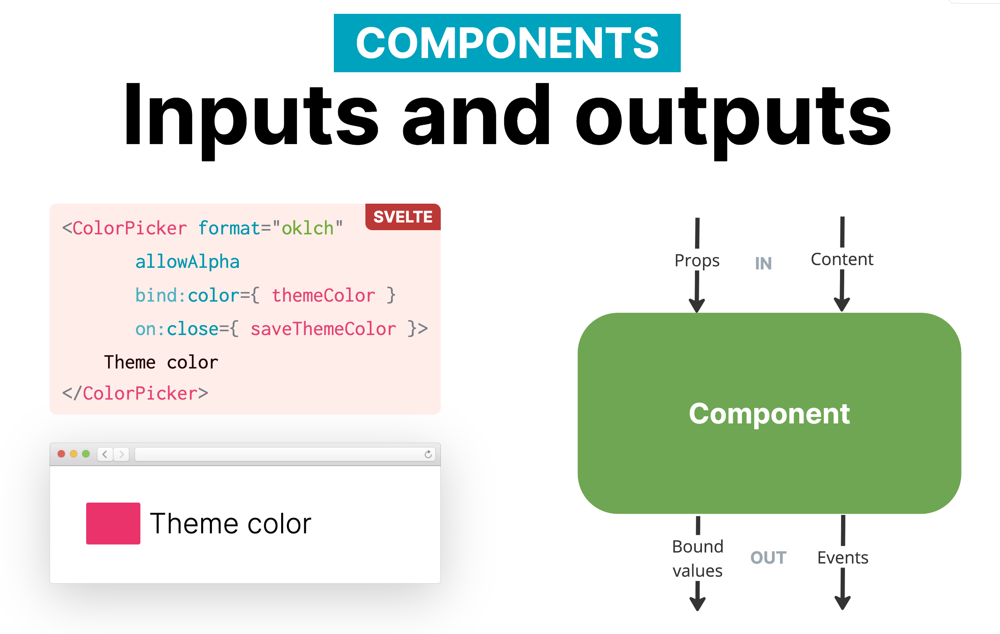
- Svelte
Performance, Less client-side JS and Easier syntax
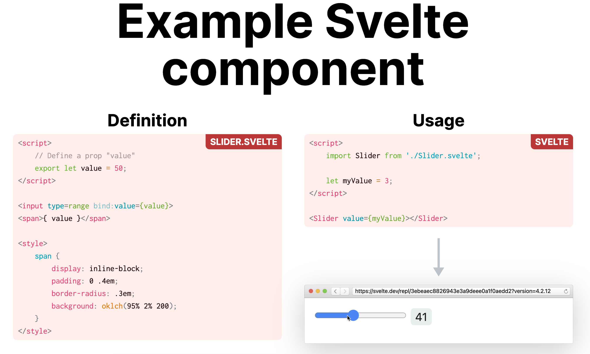

### 4.1: Setting up
Create a vis project
```
$ npm create svelte@latest my-portfolio

$ npm install && npm install -D svelte@next && npm install -D @sveltejs/adapter-static
```
Start the server 
```
npm run dev -- --open
```

### 4.2: Porting your previous website to Svelte
- First, copy your images/ folder as well as style.css and global.js to static/
- Adjust src/app.html to read upper files
- Porting your pages to routes:

projects/index.html → routes/projects/+page.svelte

cv/index.html → routes/cv/+page.svelte

contact/index.html → routes/contact/+page.svelte

- Adding titles with `<svelte:head>` element
- Adjusting navigation bar URLs, delete the trailing slash at the end of your relative URLs in global.js.

### 4.3: Publishing our new website to GitHub Pages
Add and edit these files in your project then push to deploy

`.github/workflows/deploy.yml` (https://vis-society.github.io/labs/4/download/deploy.yml)

`svelte.config.js` (https://vis-society.github.io/labs/4/download/svelte.config.js).

**Warning**: Add if neccesary a .env file with BASE_PATH=/svelte-portfolio 
to avoid, strange things

### 4.4: Templating projects from a data file

- Move your data projects to /src/lib/projects.json

Useful code to extract data from dev tools. Put it in the console log
```
$$(".projects > article").map (a => ({
	title: $('h2', a).textContent,
	image: $("img", a).getAttribute("src"),
	description: $("p", a).textContent,
}));
```
- Load your data in src/routes/projects/+page.svelte
- Be able to indicate the total count of projects

### 4.5: Displaying the first 3 projects on the home page
- Create and use **Project** component.

This line is useful only to declare a prop variable
In Project.svelte
```
export let data = {};
```
Project.svelte goes into components folder

- Showing the latest projects on the home page

Use the `<Project>` component to  show the lastest 3 with *slice*

svelte-portfolio/src/+page.svelte
```
<h1>
  Latest Projects
  <div class="projects">
    {#each projects.slice(0, 3) as p}
      <Project data={p} hLevel="3" />
    {/each}
  </div>
</h1>
```

- Customizing heading levels

Set the hierarchy of the component using props and move styles from svelte-portfolio/static/style.css to the component itself in `<style>` element.

### 4.6: Creating a layout for UI shared across pages
Create a Layout for nav.
- An app has multiple layouts generally. In our case is there is a layout for the app.html.
- The convention to create a layout component is `+layout.svelte`
- Move part of the code from `global.js` to `+layout.svelte`
- Must be placed `<slot />` inside the layout,  the page is gonna to be displayed inside it.
- Use `$page` from `$app/stores` to load page properties and detect the current page link. 
- The layout could have its own styles.

## Lab 5. Svelte II (Loading Data & Reactivity)
### Slides
- Reactivity is recalculating things when an event occurs.
- CSS is Reactive. Change a CSS variable via JS
- JS is not reactive. You have to do it with event listeners
- For reactivity in svelte do:

`$` recalculates when dependencies change and
`bind:value={a}` updates the UI when the input changes
```
<script>
	let a = 1, b = 2, c;
	$: c = a + b;
</script>

<input type="number" id="a" bind:value={a}> +
<input type="number" id="b" bind:value={b}> =
<input type="number" id="c" bind:value={c} disabled>
```

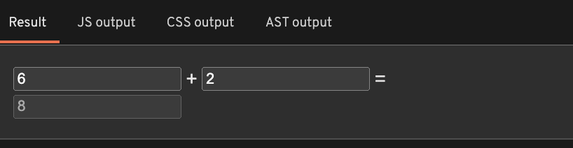

### 5.1 Port the theme switcher to Svelte (Dark/Light theme)
*Concepts*

- “Bind” in this context means that the value of the variable will be automatically updated when the value of the `<select>` changes, and vice versa.

- Html tag is not part of the svelte technology. So that's is for *document* is undefined and  `console.log(document)` throws an error `500 internal error`. 

Explanation: 

`Our Svelte code is first ran in Node.js to generate the static parts of our HTML, and the more dynamic parts make it to the browser. However, Node.js has no document object, let alone a document.documentElement object`

- When accessing properties of objects of questionable existence, we can use the optional chaining operator **?**. instead of the dot operator to avoid errors

set colorScheme variable to the "color-scheme" property in the document 
```
let root = globalThis?.document?.documentElement;
$: root?.style.setProperty("color-scheme", colorScheme);

```

- Use $ for reactivity statement

- Save the color-scheme to localStorage and get it again to keep the theme switcher in other pages 
```
let localStorage = globalThis.localStorage ?? {};

$: localStorage.colorScheme = colorScheme;

```

- Preventing FOUC (Flash of Unstyled content) add the `script` code to the app.html
A strange behavior when theme changes after the page has loaded

This code set the theme before the page has loaded. 

app.html 
```
<script type="module">
	let root = document.documentElement;
	let colorScheme = localStorage.colorScheme ?? "light dark";
	root.style.setProperty("color-scheme", colorScheme);
</script>
```

### 5.2 Loading data from an API
Images of the results
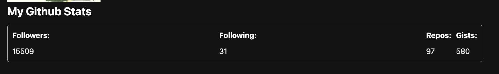
- Use an API to extract github stats data. An example from `https://api.github.com/users/your-username`
- *fetch* is an example of an asynchronous function. This means that it does not return the data directly, but rather a Promise that will eventually resolve to the data. In fact, fetch() returns a Promise that resolves to a Response object, which is a representation of the response to the request. To get meaningful data from a Response object, we need to call one of its methods, such as json(), which returns a Promise that resolves to the JSON representation of the response body.

Extract a promise
```
  let promise = fetch("https://api.github.com/users/leaverou").then(
    (response) => response.json(),
  );
```

- Use the `#await`block for managing promises

syntax 
```
{#await promise}
	Loading...
{:then data}
	The data is {data}
{:catch error}
	Something went wrong: {error.message}
{/await}
```
- Use `<dl>`, `<dt>` and `<dd>` tags and styles to custom display information like the picture.
- Update the year of your projects.

## Lab 6: Visualizing categorical data with D3
### Slides
No slides but useful information for this lab
- [Material](https://vis-society.github.io/lectures/intro-svelte-d3.html)
- [59 different examples as reusable templates.](https://observablehq.com/collection/@d3/charts)
- [Convert into svelte + d3.js format](https://svelte.dev/repl/4cc901a472a54219974552ee2b71fefd?version=4.2.18)
- Create a more sophisticated component so, for instance `<Sunburst {data} width=1152 height=1152 />` instead of `Sunburst(data, {width: 1152, height: 1152, ...})`

### 6.0 Show year in each project
- Add some description to projects.json
- Add the year of the article
- Style the article

### 6.1: Creating a pie chart with D3
- Create a Pie.svelte component
- Create a circle svg

### 6.1.3 Using a `<path>` instead of a `<circle>`