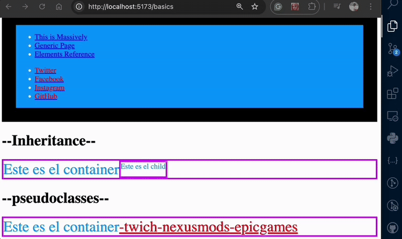

# CURSO DE CSS COMPLETO: De Principiante a Front-End 2024
[Video Tutorial](https://www.youtube.com/watch?v=TlJbu0BMLaY)

## Enlaces recomendados
- [Manz.dev](https://lenguajecss.com/)
- [Google](https://web.dev/learn/css)
- [mdm](https://developer.mozilla.org/es/docs/Web/CSS#tutoriales) `<-- la mejor`
- [codilink](https://codi.link/) for online practice

## Calculators
- [oklch](https://oklch.com/)

# Content
## 1. Basics
### 1.1 Colors
Different ways to set colors with property-values `rgb`, `hsl`, `olkch`

> [!NOTE] A good practice to build your site is to use *classes* and not *identifiers* like `#`.

### 1.2 Inheritance 
In inheritance is important to use *fallbacks* in case the first value of the property does not exits, then use the second value and so on. 

### 1.3 Pseudo classes 
- They are states of properties
- These are `hover`, `active`, `focus`, `first-child`, `last-child` etc
- Border and outline. Border makes a little jumping, but outline not.

### 1.4 Combined selectors
- Combined selector to paint text
- Use operators (1:00:00) like `>` (direct childs), `~` (brothers elements), `+` direct child <-- used by adjoining buttoms. 

### 1.5 Cascading
If an element is set two times, it will take the property of the last one.

### 1.6 Specifity
- Applies the declaration which is more spefic. See [specifity calculator](https://specificity.keegan.st/) 

- In the example the last declaration with `p` (general) doesn't work because the *specifity* of `text` is stronger (more specific). Specifity for Blue is (0,1,0) and for red (0,0,1).

- Complex specifity

- Libraries that help with specifity like *tailwindcss*

- *Styling lines*  and `!important` breaks the rule of specifity. 1:15:00. Don't use them.

### 1.7 Absolute and relative units
- `px` is an *absolute* value.
- `50vh` 50% *relative* to the viewport height
- *Reset css* change default css values, is not used now. *Normalize css*  common css values for different **browsers**.
